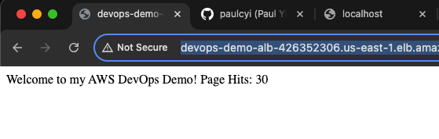
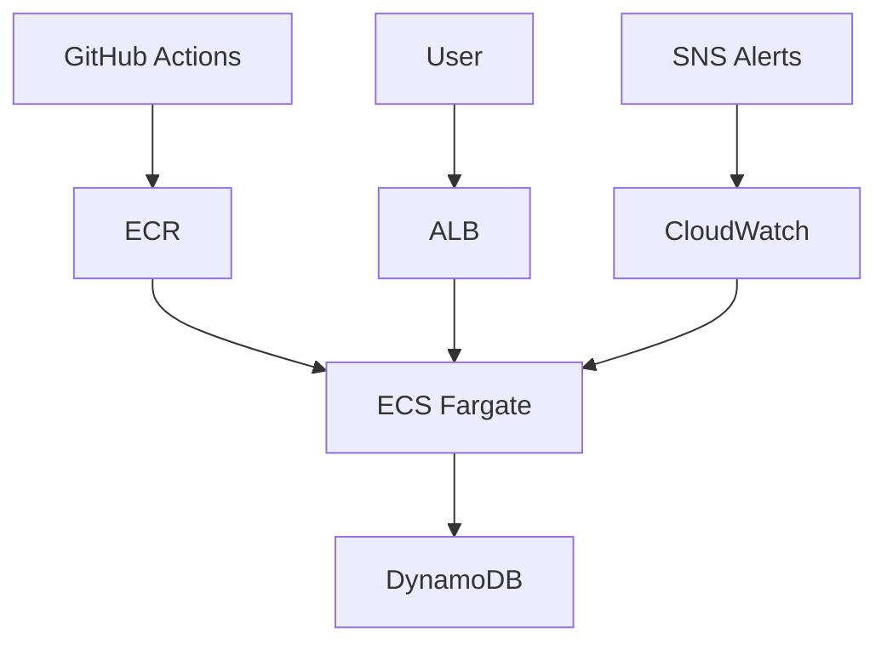

# AWS DevOps Demo


## Table of Contents
- [Live Counter](#live-counter)
- [Project Overview](#project-overview)
- [Technologies Used](#technologies-used)
- [Installation and Usage](#installation-and-usage)
  - [Local Setup](#local-setup)
  - [Prerequisites](#prerequisites)
- [Architecture Diagram](#architecture-diagram)
- [Contributing](#contributing)
- [License](#license)
- [Acknowledgements](#acknowledgements)

Welcome to the AWS DevOps Demo! This project showcases a scalable web application hosted on AWS Elastic Container Service (ECS) using Fargate, featuring a live DynamoDB-based hit counter. It demonstrates CI/CD with GitHub Actions, Docker containerization, and Terraform for infrastructure as code (IaC). Built as my first DevOps GitHub makeover project, it highlights my skills in cloud infrastructure, automation, and problem-solving.

## Live Counter
Check out the live hit counter in action:
[View Live Counter](http://devops-demo-alb-426352306.us-east-1.elb.amazonaws.com/)
*(Note: URL may vary based on your AWS environment—update accordingly.)*



## Project Overview
This project is a hands-on implementation of a DevOps workflow, leveraging AWS services to deploy a Python Flask application. The hit counter increments with each page visit, stored in Amazon DynamoDB, and served via an Application Load Balancer (ALB) on ECS with Fargate. The infrastructure is defined using Terraform, with automated builds and deployments managed by GitHub Actions. Key challenges overcome include backend state drift, IAM policy scoping, and container dependency management.

## Technologies Used
- **Languages/Frameworks**: Python (Flask), Docker 
- **Cloud Services**: AWS (ECS, Fargate, ALB, DynamoDB, IAM, S3, CloudWatch, ECR)
- **Infrastructure as Code**: Terraform 
- **CI/CD**: GitHub Actions 
- **Skills Demonstrated**: CI/CD pipelines, container orchestration, IaC, cloud security, troubleshooting (e.g., fixing S3 backend issues, IAM permissions).

## Installation and Usage
### Local Setup
1. **Create a Virtual Environment**:
   ```bash
   python3 -m venv venv
   ```

2. **Activate the Virtual Environment**:
   ```bash
   # macOS/Linux
   source venv/bin/activate
   
   # Windows
   venv\Scripts\activate
   ```

3. **Install Dependencies**:
   ```bash
   pip install -r app/requirements.txt
   ```

4. **Build and Run Docker Locally**:
   ```bash
   docker build -t aws-devops-demo -f Dockerfile .
   docker run -p 5001:5001 aws-devops-demo
   ```

5. **Access the Counter**:
   ```bash
   # Open in your browser
   http://localhost:5001
   ```

### Prerequisites
- AWS CLI configured with appropriate credentials.
- Docker installed locally.
- Terraform installed (version 1.5.7 recommended).

## Architecture Diagram

*(This Mermaid diagram shows the flow: GitHub Actions builds and pushes to ECR, ECS runs the container with DynamoDB, ALB routes traffic, and CloudWatch/SNS monitor.)*

## Contributing
Feel free to submit pull requests or issues! Please follow these guidelines:
- Fork the repository.
- Create a feature branch (`git checkout -b feature/new-feature`).
- Commit changes (`git commit -m 'Add new feature'`).
- Push and open a pull request.

## License
This project is licensed under the MIT License - see the [LICENSE](LICENSE) file for details.

## Acknowledgements
- Thanks to the xAI Grok team for guidance in building this project.
- Inspired by AWS DevOps best practices and community resources.

<!-- Final v1.0 release marker -->
